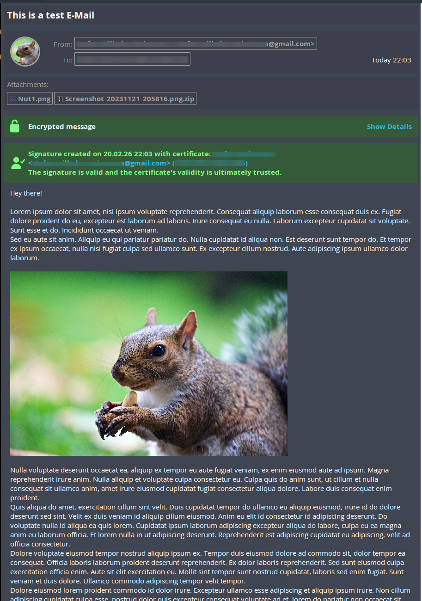
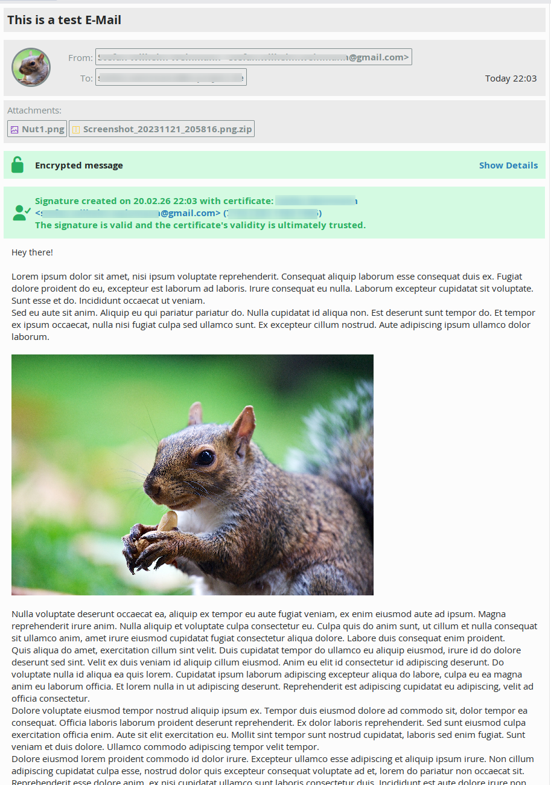

# Modern Mail Header for Kmail

This is a modern Mail header for Kmail. It should fit on any colour schema and should also fits well with light and darkmode colours.

Look at your home directory unter `~/.local/share/messageviewer/themes` and copy this theme in an sub folder.

This mail header theme uses fontawesome 7 free
